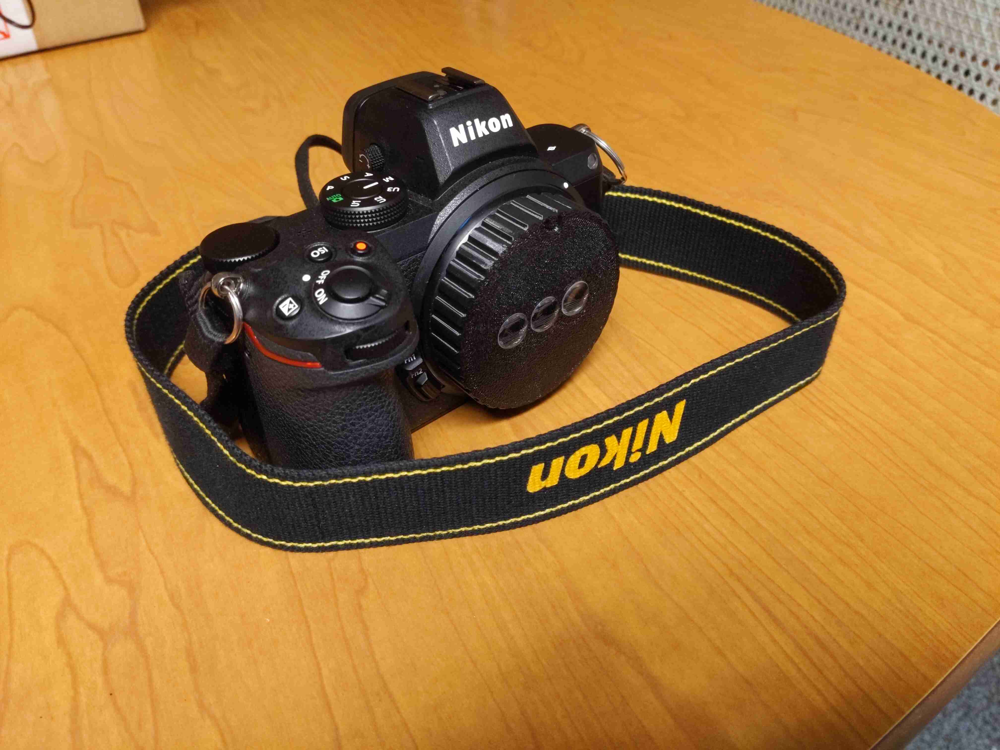
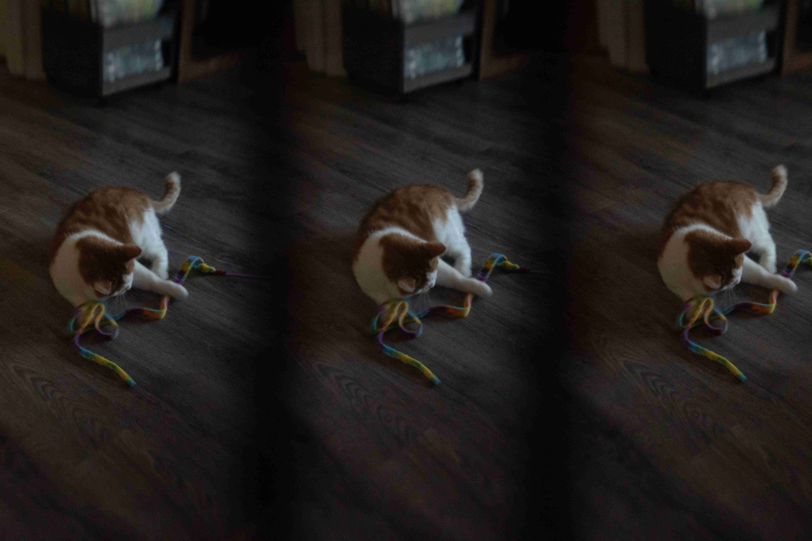

## What is a wigglegram?

A [wigglegram](https://en.wikipedia.org/wiki/Wiggle_stereoscopy)
is a collection of images that vary slightly in perspective.
When these images are animated together, they create an illusion of depth.

<!-- markdownlint-disable-next-line MD033 MD013 -->

## EweWiggle

<!-- markdownlint-disable-next-line MD033 -->

EweWiggle is a 3d printed wigglegram lens that uses some off-the-shelf glass from
[SurplusShed](https://www.surplusshed.com/).
It was designed for full-frame cameras and is similar to other wigglegram lens designs
that exist. However, most other designs use lenses from disposable cameras.

The SurplusShed lenses I used aren't ideal for high-quality photography.
The main issue is the uneven focal field which makes focusing on a flat surface difficult.
Furthermore, all the lenses are facing directly forwards.
This causes the resulting images to be focused on slightly different points,
which, after processing them, results in less usable image width.

<!-- markdownlint-disable MD033 -->

<video height="400" controls>
   <source src="../../media/ArchieWiggle2.mp4" type="video/mp4">
</video>
<!-- markdownlint-enable MD033 -->

Here we can see that the original three images vary horizontally,
so we have to crop parts of the images when we overlay them to make the animation.

We could solve this issue if our middle lens were straight, but our other two lenses
were rotated slightly inwards towards the object of interest.
This is, after all, how our eyes actually work, so it should yield better results.
