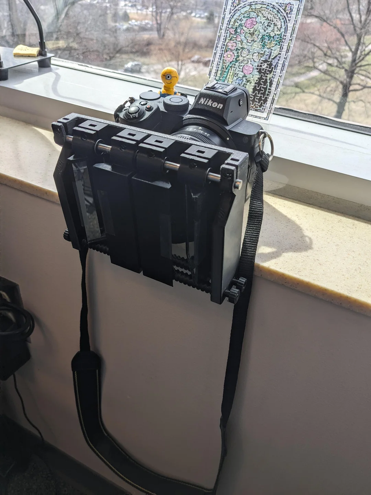
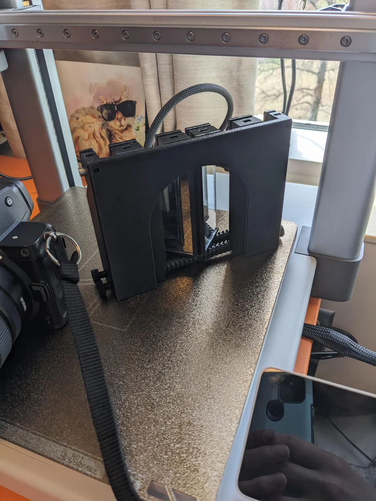
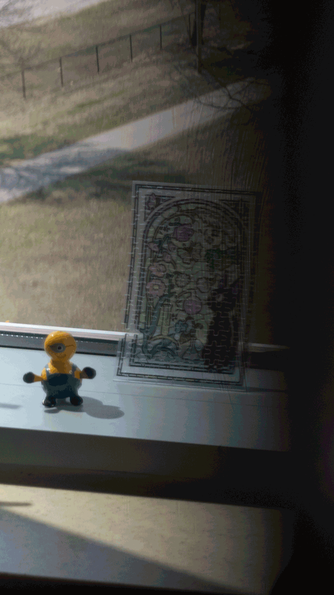

## What is a wigglegram?

A [wigglegram](https://en.wikipedia.org/wiki/Wiggle_stereoscopy)
is a collection of images that vary slightly in perspective.
When these images are animated together, they create an illusion of depth.

<!-- markdownlint-disable-next-line MD033 MD013 -->

## Lens-Based Wigglegrams

<!-- markdownlint-disable-next-line MD033 -->

EweWiggle is a 3d printed wigglegram lens that uses some off-the-shelf glass from
[SurplusShed](https://www.surplusshed.com/).
It was designed for full-frame cameras and is similar to other wigglegram lens designs
that exist. However, most other designs use lenses from disposable cameras.
I will refer to these methods as "lens-based" wigglegrams.

The SurplusShed lenses I used aren't ideal for high-quality photography.
The main issue is the uneven focal field which makes focusing on a flat surface difficult.
Furthermore, all the lenses are facing directly forwards.
This causes the resulting images to be focused on slightly different points,
which, after processing them, results in less usable image width.

<!-- markdownlint-disable MD033 -->

    
    <video controls height="400">
        <source src="../../media/ArchieWiggle2.mp4" type="video/mp4">
    </video>

<!-- markdownlint-enable MD033 -->

Here we can see that the original three images vary horizontally,
so we have to crop parts of the images when we overlay them to make the animation.

We could solve this issue if our middle lens were straight, but our other two lenses
were rotated slightly inwards towards the object of interest.
This is, after all, how our eyes actually work, so it should yield better results.

## Mirror-Based Wigglegrams

Rather than using boutique lenses, it would be much more convenient if we could
use a normal lens and somehow modify it so that it can take multiple pictures
at once. In fact, this is exactly what "beam splitters", "stereo attachments",
or "3D lens attachments" do.
[This blog article](https://stereoscopy.blog/2022/03/04/stereoscopic-3d-photography-with-a-single-lens/)
I came across introduces the topic nicely.
I will be referring to this approach as "mirror-based" wigglegrams.

A mirror based approach to wigglegrams is much more versatile because we could
ideally fit the beamsplitter on a wide range of lenses of different qualities
and focal lengths. We also now have the ability to focus on objects that are
closer or further away.

<!-- markdownlint-disable MD033 -->

    
    

    
Flashing Lights Warning!

    

<!-- markdownlint-enable MD033 -->

Pictured above is my most recent prototype (February 2025) for EweMirror.
This iteration involves two screws at the bottom, which are reverse threaded
halfway through. One screw allows the inner mirrors to move inwards or outwards
and the other screw allows the outer mirrors to move.
They also glide along a metal rod above with linear bearings.

Moving the inner mirror allows the photographer to adjust the width of the
middle image relative to the outer images. We could close the gap completely
in order to take a stereoscopic image.

The outer mirrors are angled slightly inwards which solves the main issue I
had with glass-based wigglegrams. Furthermore, the outer mirrors can be moved
so that the perspective can vary. This matters because different mirror
positions are required to get properly centered images
for different focal lengths.

Unfortunately, the construction is quite bulky, especially since I designed it
to be used with several different focal lengths and lens sizes.
The plastic is light, but the mirrors and metal add quite a bit of weight.
Furthermore, this design doesn't do well with focal lengths too narrow.
For larger than around 75mm (full frame), centering the images becomes
impossible.

The production process also raises some issues. I'd like to have high-quality,
but thin mirrors to use for the surfaces, which is quite costly.
I also have been cutting the mirrors to size myself, which is difficult and
imperfect.
